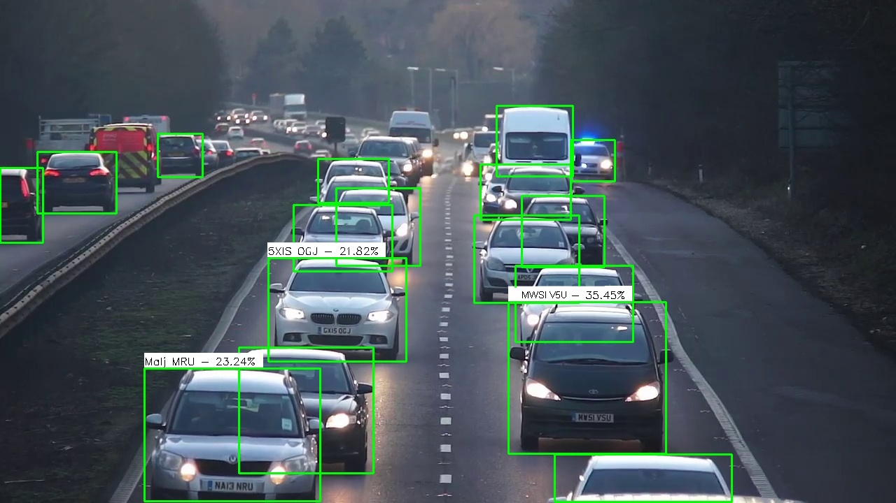

# safe-driving

mini-project Machine Learning 2023-24

Input Video → split frames to images → Detect cars using YOLO model → Draw rectangles around coordinates in image result → Track and ID cars using SSIM → If >30 frames since last calculation, for that car use contour math to try and find a visible licence plate → if found, extract and run OCR → if succesful, write the result on the result image → compile all result frames into output video

